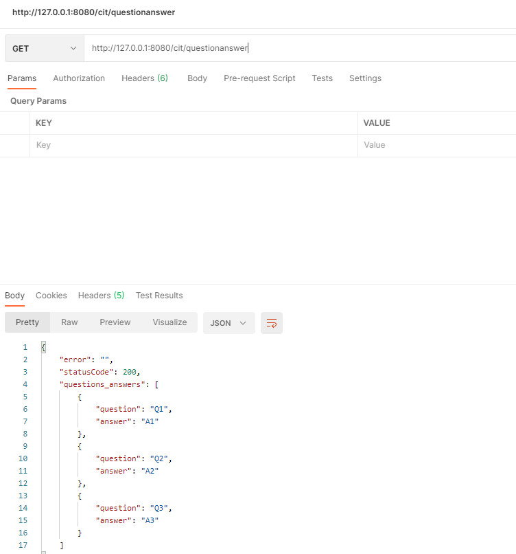

## Functionality

REST API that works with a "data" source of questions and answers.

### Purpose

- Gain experience writing and executing Node.js REST API server using VSCode
- Learn to use Fastify with the GET verb, routes, and route parameters [server-code](https://github.com/Jiah-design/cit281-p4/blob/main/p4-server.js)
- Work with static data and testing code module without using a web server
- Use Postman to test web server routes

[Code module file](https://github.com/Jiah-design/cit281-p4/blob/main/p4-module.js) with 6 different functions to retrieve different values within the object of the data questions.

GET response on Postman  

